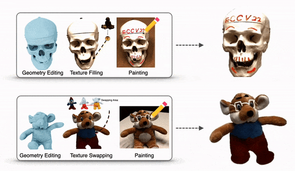
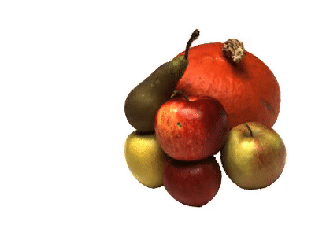
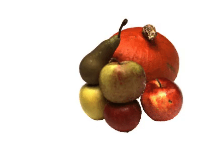

# NeuMesh: Learning Disentangled Neural Mesh-based Implicit Field for Geometry and Texture Editing

### [Project Page](https://zju3dv.github.io/neumesh/) | [Video](https://www.youtube.com/watch?v=8Td3Oy7y_Sc) | [Paper](http://www.cad.zju.edu.cn/home/gfzhang/papers/neumesh/neumesh.pdf)
<div align=center>

</div>

> [NeuMesh: Learning Disentangled Neural Mesh-based Implicit Field for Geometry and Texture Editing](http://www.cad.zju.edu.cn/home/gfzhang/papers/neumesh/neumesh.pdf)  
> 
> [[Bangbang Yang](https://ybbbbt.com), [Chong Bao](https://github.com/1612190130/)]<sup>Co-Authors</sup>, [Junyi Zeng](https://github.com/LangHiKi/), [Hujun Bao](http://www.cad.zju.edu.cn/home/bao/), [Yinda Zhang](https://www.zhangyinda.com/), [Zhaopeng Cui](https://zhpcui.github.io/), [Guofeng Zhang](http://www.cad.zju.edu.cn/home/gfzhang/). 
> 
> ECCV 2022 Oral
> 


⚠️ Note: This is only a preview version of the code. Full code (with training scripts) will be released soon.

## Installation
We have tested the code on Python 3.8.0 and PyTorch 1.8.1, while a newer version of pytorch should also work.
The steps of installation are as follows:

* create virtual environmental: `conda env create --file environment.yml`
* install pytorch 1.8.1: `pip install torch==1.8.1+cu111 torchvision==0.9.1+cu111  -f https://download.pytorch.org/whl/torch_stable.html`
* install [open3d **development**](http://www.open3d.org/docs/latest/getting_started.html) version: `pip install [open3d development package url]`
* install [FRNN](https://github.com/lxxue/FRNN), a fixed radius nearest neighbors search implemented on CUDA.

## Data
We use DTU data of [NeuS version](https://github.com/Totoro97/NeuS).
Please specify the `data_dir` in the `configs/.yaml` before evaluation.

## Evaluation
Here we provide a [pre-trained model](https://zjueducn-my.sharepoint.com/:f:/g/personal/12021089_zju_edu_cn/EgCdXYjaVThOnlxq5Xy-2RcBBgOSmwSxMJRtaLlSPp_mlQ?e=268T7p) of DTU scan 63.

### Novel view synthesis
You can evaluate images with provided pre-traied models.
```python
python -m render --config configs/neumesh_dtu_scan63.yaml   --load_pt ./checkpoints/dtu_scan63/latest.pt --camera_path spiral --num_views 90 --background 1 --dataset_split entire --test_frame 24 --spiral_rad 1.2
```

<div align=center>

</div>

### Texutre Swapping
You can perform texture swapping with provided configs to swap the texture of red and gold apples on dtu_scan 63.

```python
python -m render_texture_swapping --config configs/texture_swapping_dtu_scan63.json --camera_path spiral --rayschunk 1024 --downscale 4 --num_views 90 --edit_method code --dataset_split entire --outdirectory texture_swapping --test_frame 24 --spiral_rad 1.2
```

<div align=center>

</div>

## Citing
```
@inproceedings{neumesh,
    title={NeuMesh: Learning Disentangled Neural Mesh-based Implicit Field for Geometry and Texture Editing},
    author={{Chong Bao and Bangbang Yang} and Zeng Junyi and Bao Hujun and Zhang Yinda and Cui Zhaopeng and Zhang Guofeng},
    booktitle={European Conference on Computer Vision (ECCV)},
    year={2022}
}
```
Note: joint first-authorship is not really supported in BibTex; you may need to modify the above if not using CVPR's format. For the SIGGRAPH (or ACM) format you can try the following:
```
@inproceedings{neumesh,
    title={NeuMesh: Learning Disentangled Neural Mesh-based Implicit Field for Geometry and Texture Editing},
    author={{Bao and Yang} and Zeng Junyi and Bao Hujun and Zhang Yinda and Cui Zhaopeng and Zhang Guofeng},
    booktitle={European Conference on Computer Vision (ECCV)},
    year={2022}
}
```
## Acknowledgement
In this project we use parts of the implementations of the following works:

* [NeuS](https://github.com/Totoro97/NeuS) by Peng Wang
* [neurecon](https://github.com/ventusff/neurecon) by ventusff

We thank the respective authors for open sourcing their methods.


